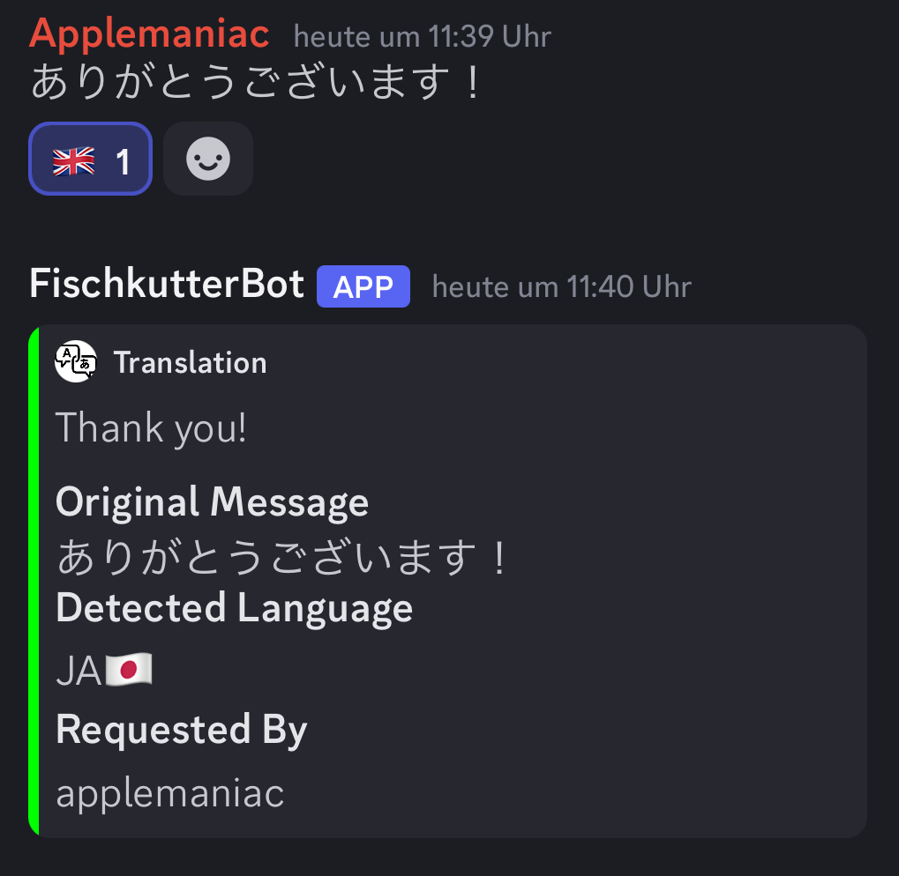

# Discord Translate Bot

Welcome to the Discord Translate Bot! This simple bot helps you translate messages in your Discord server using LibreTranslate.

## Features

- Translate messages from one language to another using reactions.
- Supports multiple languages: German, English, Japanese...
- Login mechanism using the `$Login` command.

## Setup

To run this bot, you will need to create a `.env` file in the root directory of your project. This file should contain your Discord token, password for the bot, and the LibreTranslate API URL. All python related requirements are listed in the requirements.txt file.


### .env File

Create a file named `.env` and add the following variables:

```env
TOKEN=your-discord-token
PW=password-for-fischkutterbot
TRANSLATE_URL=libretranslate-address
```

Replace `your-discord-token`, `password-for-fischkutterbot`, and `libretranslate-address` with your actual Discord bot token, the password you want to use for logging into the bot, and the address of your LibreTranslate instance, respectively.
There are free-to-use mirrors of LibreTranslate available, which you can find in the [GitHub repository of LibreTranslate](https://github.com/LibreTranslate/LibreTranslate?tab=readme-ov-file#mirrors)

## How to Use

1. Invite the bot to your Discord server.
2. Use the ```$Login``` command followed by the password specified in the .env file to log in. The password can be left blank if not required.
3. After logging in, you can use the bot to translate messages. (Include examples of commands here)

## Screenshots

Here is a screenshot of the bot in action:



## License

This project is licensed under the MIT License.

---